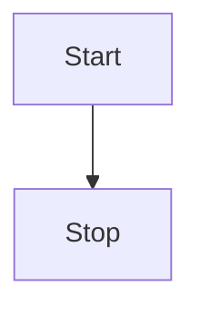
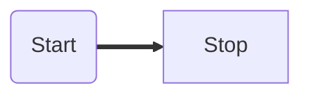
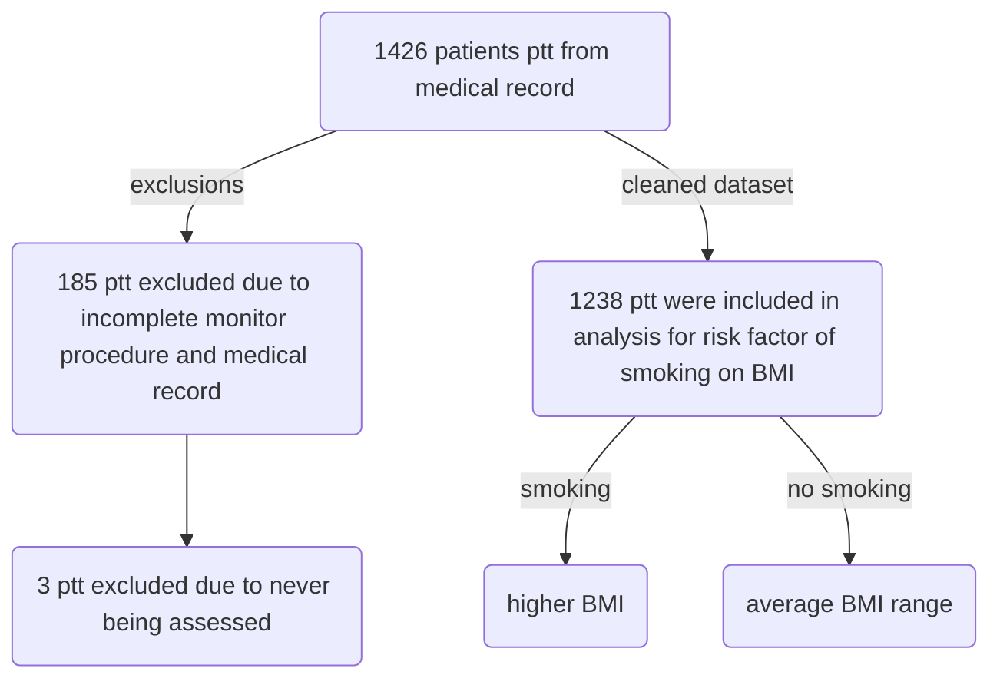

# Cai McCann | Homework_1 | 1/15/2020


1.	Make sure everything is set up and working on the laptop that you will be using for this course (most current versions of R and RStudio, tinytex package, Typora (a markdown editor), Notepad++, GitHub account)
2.	Learn markdown in Typora.
3.	Create a typora document to illustrate the following formatting:
   •	headers (levels 1-6)
   •	unordered lists
   •	ordered lists
   •	manual line breaks
   •	links
   •	images
   •	block quotes
   •	plain code blocks
   •	R code blocks
   •	in line block
   •	in line LaTeX equation
   •	centered LaTeX equation
   •	horizontal rule
   •	simple table


# Headers


# Header

## header

### header

#### header

##### header

###### header


# Unordered list

* unordered lists
* underordered lists
  * subset unordered list


# Manual line break


###### ^that was a manual line break

# Links

<https://lvash.github.io/Bio381/>

[a very useful website](https://lvash.github.io/Bio381/])


# Images


# Block quotes

> In this first paragraph, it should be noted that Blockquote is a 10 letter word. 
>
> >I did another sideways carat for fun. 
>
> This is another, second paragraph just for the heck of it. 


> I separated out the blockquote just now, using the enter button multiple times to exit from each block quote. 


> o 
>
> > o
> >
> > > o
> > >
> > > > o
> > > >
> > > > > _____________________________________
> > > > >
> > > > > > o  
> > > > > >
> > > > > > > o


# Code blocks...

### (Fenced) Code Blocks == Plain code blocks

```

```


``````

``````


``````
I just made a blank box (similar to a text box)--need 6 back ticks ` or you can use tildas ~
``````

### Code span // non "pre-formatted code block"? == In line blocks

`printf()`

`maybe?`

`insert text between backtick quotes`

```function test() {console.log("notice the blank line before this function?");}```


### R code block

```R

```

** this is coded for R* language specifically


# LaTeX equation fun

### In line LaTeX equation

$z_{n+1}= z*n^2+c$	

### Centered LaTeX equation

$$
z_{n+1}= z*n^2 + c
$$


# Horizontal rule

***

---


***

---

# Simple table

| First header                       | Second Header |
| ---------------------------------- | ------------- |
| this is one sleek looking table :) |               |


# Diagrams! 

** This is in Mermaid*

We ran through some examples together in class






4 - 9.
- create simple cause-and-effect diagram to illustrate one or two hypotheses from your research. Circles represent variables or measurements. Arrows (which can be labelled) indicate cause and effect directions.

- import the image into your Typora document.

- convert your hand-drawn flowchart into one of these display items and imbed it in your Typora document.

- explore themes and save results

Ok, now my attempt:

	Before: 


	After: 



